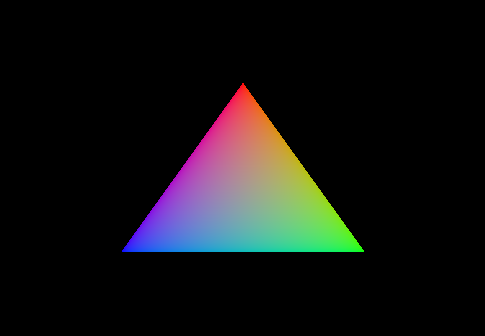

# VulkanExperiments

Collection of experiments with the Vulkan Graphics API.

## Table of Contents

- [Programs](#programs)
  0. [Triangle](#0-triangle)
- [Building](#building)
  - [Requirements](#requirements)
- [Build Status](#build-status)

## Programs

### 0. Triangle



[Source code](src/triangle/main.cpp)

Based on https://vulkan-tutorial.com/Drawing_a_triangle/Setup/Base_code.

## Building

A convenience build script is also provided, for building all targets, and optionally installing to a location:
```
./build.sh <OPTIONAL_INSTALL_LOCATION>
```

### Requirements

- `GLFW`
- `CMake >=-3.17`
- `Vulkan SDK` with `glslc` compiler.

## Build Status

|       | master | 
| ----- | ------ | 
| macOS-10.14 | [](https://travis-ci.com/moddyz/VulkanExperiments) |

